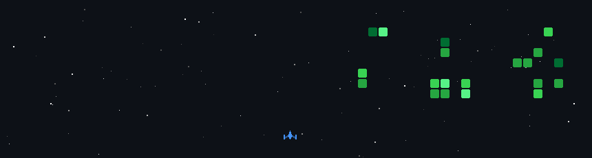

# talhacalik
Software Engineer | Backend Developer
- 🎓 Computer Engineering, Atatürk University (2021–2026)
- 📍 Based in Samsun, Turkey
- ✉️ Contact: calikmuhammedtalha@gmail.com

<b>Competencies</b>

## ⚙️ Backend Development

## 💾 Data & Infrastructure

## 📱 Mobile Development

## 🛠️ Development & DevOps

